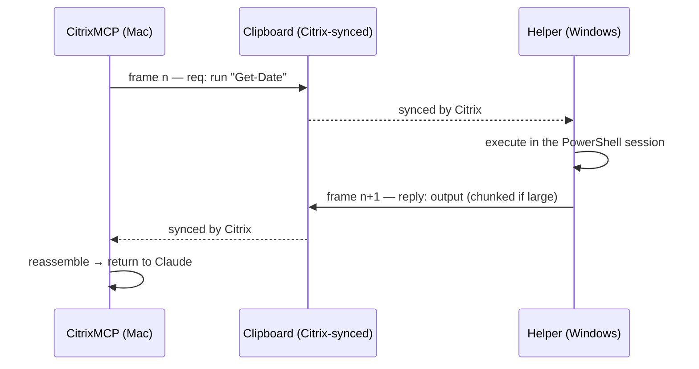

<div align="center">

# 🖥️ CitrixMCP

### Drive a Windows PowerShell session inside a Citrix / RDP window — from Claude, over the clipboard.

Run commands, control the desktop, capture screenshots, and move files **in and
out** of a locked-down remote session that has **no SSH and no WinRM** — using
the one channel that always crosses the gap: the **synced clipboard**.

[](https://github.com/FrancoisChastel/CitrixMCP/actions/workflows/ci.yml)
[](./LICENSE)
[](https://nodejs.org)
[](https://modelcontextprotocol.io)


</div>

---

## Why this exists

Some Windows machines are only reachable through a **double hop** — a Citrix
Workspace client that publishes an RDP window, which in turn logs into the box:

```
 Your Mac  ──Citrix Workspace──▶  published mstsc.exe  ──RDP──▶  Windows box + PowerShell
```

There is no direct network path (no SSH, no WinRM) to that final machine. The one
thing that reliably travels across all three boundaries is the **clipboard**,
which Citrix keeps synchronized in both directions. CitrixMCP turns that shared
clipboard cell into a reliable, ordered command-and-file channel, and exposes it
to Claude (or any MCP client) as a clean set of tools.

## Architecture

```mermaid
flowchart LR
    A["Claude session<br/>(MCP client)"] -->|stdio| B["CitrixMCP server<br/>Node · macOS"]
    B <-->|pbcopy / pbpaste| CB1["macOS clipboard"]
    CB1 <-->|Citrix clipboard sync| CB2["Windows clipboard"]
    CB2 <-->|Get / Set-Clipboard| H["rdt-agent helper<br/>PowerShell or Python"]
    H -->|runs| PS["PowerShell · desktop · files"]

    classDef mac fill:#0b7285,stroke:#083f4d,color:#fff
    classDef win fill:#5f3dc4,stroke:#3b2593,color:#fff
    class A,B,CB1 mac
    class CB2,H,PS win
```



The link runs a classic **stop-and-wait protocol** over that single shared cell:
each message is a full clipboard write of `RDT1|<base64(json)>`, with sequence
numbers for ordering and de-duplication, automatic retransmit if the user
clobbers the clipboard mid-exchange, and chunking for large payloads.

## Features

- 🧑‍💻 **Full PowerShell control** — persistent working directory, real output.
- 🪟 **Desktop & GUI control** — list/focus windows, move & click the mouse, type text, send key combos.
- 📸 **Screenshots** — capture the remote desktop as PNG and see it inline.
- 📦 **File transfer both ways** — binary-safe, chunked, hash-verified.
- 🔌 **No SSH / WinRM / agents on the network** — clipboard only.
- 🛡️ **Safe, auditable helper** — no network, no persistence, prints every command.
- 🔁 **Reconnect-friendly** — survives Citrix disconnect/reconnect and Claude restarts.
- 🐍 **Two interchangeable helpers** — PowerShell *or* stdlib-only Python (for SRP-locked boxes).

## Quick start

### 1. Register the MCP server (on the Mac)

**Zero-install, straight from the repo** (npm clones and builds it for you):

```bash
claude mcp add citrix -s user -- npx -y github:FrancoisChastel/CitrixMCP
```

<details>
<summary>Or from a local clone / for Claude Desktop</summary>

```bash
git clone git@github.com:FrancoisChastel/CitrixMCP.git && cd CitrixMCP
npm install          # installs deps and builds dist/ via the prepare script
claude mcp add citrix -s user -- node "$PWD/dist/index.js"
```

Claude Desktop (`claude_desktop_config.json`) or any MCP client:

```json
{
  "mcpServers": {
    "citrix": {
      "command": "npx",
      "args": ["-y", "github:FrancoisChastel/CitrixMCP"]
    }
  }
}
```

`-s user` registers it for **all** your projects/sessions. Add an `"env"` block
for any [configuration](#configuration) overrides.
</details>

### 2. Start the helper (inside the Citrix/RDP Windows session)

Pick whichever your locked-down box allows — both speak the same protocol, so the
server works with either.

**PowerShell** (`windows/rdt-agent.ps1`):

```powershell
.\rdt-agent.ps1 -DryRun   # safe first run: prints commands, executes nothing
.\rdt-agent.ps1           # go live
```

> **“cannot be loaded … blocked by software restriction policies”?** That blocks
> the `.ps1` *file*, not PowerShell. Check `$ExecutionContext.SessionState.LanguageMode`:
> - `FullLanguage` → run it interactively: `Get-Content .\rdt-agent.ps1 -Raw | iex`
> - `ConstrainedLanguage` → use the Python helper below.

**Python** (`windows/rdt_agent.py`) — standard library only, any Python 3.6+:

```powershell
python rdt_agent.py --dry-run   # or:  py rdt_agent.py --dry-run
python rdt_agent.py
```

Leave the helper running. Stop it anytime with **Ctrl+C**.

### 3. Use it

Ask Claude to `rdt_ping` (confirms the round-trip), then `rdt_run` a command.
That’s it. 🎉

## Tools

| Tool | What it does |
|------|--------------|
| `rdt_ping` | Confirm the helper is alive; returns host / user / PowerShell version. |
| `rdt_run` | Run a PowerShell command/script; working directory persists between calls. The universal tool. |
| `rdt_launch` | `Start-Process` a program (`powershell.exe`, `notepad.exe`, a path, a document); returns PID. |
| `rdt_list_windows` | List visible top-level windows as JSON `[{pid, process, title}]`. |
| `rdt_focus` | Bring a window to the foreground by PID or title substring. |
| `rdt_send_keys` | Send key combos (.NET SendKeys syntax, e.g. `^c`, `{F5}`), optionally activating a window first. |
| `rdt_type` | Type arbitrary literal text (special chars auto-escaped; newlines press Enter). |
| `rdt_mouse` | Move the cursor to `(x, y)` and optionally click (left/right/middle · click/double). |
| `rdt_screenshot` | Capture the remote desktop as PNG and return it as an image. |
| `rdt_processes` | List top processes by memory as JSON `[{pid, name, ws_mb, cpu}]`. |
| `rdt_upload` | Send a local file or inline text into a file on the Windows box (binary-safe, chunked). |
| `rdt_download` | Pull a file off the Windows box to a local path (binary-safe, chunked). |

**A GUI-driving loop:** `rdt_screenshot` to see → `rdt_list_windows` / `rdt_focus`
to target → `rdt_mouse` / `rdt_type` / `rdt_send_keys` to act → screenshot to confirm.

## How it works



One operation is in flight at a time (there is a single clipboard cell), each
frame is acknowledged before the next, and a frame is retransmitted if the peer
goes quiet — so a stray copy/paste during a transfer is recovered, not fatal.
The `src/protocol.ts` file is the single source of truth for the frame format;
both helpers implement it identically (verified byte-for-byte in CI).

## Configuration

Environment variables on the **server** (Mac) side, all optional:

| Variable | Default | Meaning |
|----------|---------|---------|
| `RDT_POLL_INTERVAL_MS` | `250` | Clipboard poll interval. |
| `RDT_RETRANSMIT_MS` | `2500` | Re-assert a frame if the peer goes quiet this long. |
| `RDT_FRAME_TIMEOUT_MS` | `60000` | Give up on one frame round-trip. |
| `RDT_EXEC_TIMEOUT_MS` | `120000` | Default per-command wait. |
| `RDT_CHUNK_BYTES` | `262144` | Payload bytes per frame before base64. |
| `RDT_RESTORE_CLIPBOARD` | `true` | Restore the user’s clipboard after each op. |
| `RDT_DEBUG` | `false` | Verbose frame logging to stderr. |

Helper flags mirror these: `-PollMs`, `-ChunkBytes`, `-DefaultTimeoutMs`,
`-DryRun`, `-DenyRegex`, `-Quiet` (PowerShell) / `--dry-run`, `--deny-regex`, … (Python).

## Safety

The Windows helper runs on what may be a sensitive machine, so it is deliberately
conservative:

- **One readable file**, no obfuscation — read it top to bottom before running.
- **No network.** It never opens a socket; the clipboard is the only channel.
- **No persistence.** Runs in your console only; Ctrl+C stops it. No service,
  scheduled task, registry key, or startup entry.
- **Does nothing on its own.** It only runs the commands you send — the same
  ones you could type yourself. Runs as you, no elevation.
- **Transparent.** Every command is printed before it executes.
- **Opt-in guardrails.** `-DryRun` / `--dry-run` echoes without executing;
  `-DenyRegex` / `--deny-regex` refuses matching commands.

Only reacts to clipboard values beginning with the `RDT1|` marker — normal
copy/paste is ignored.

## Testing

**Offline** (no Windows, no Citrix):

```bash
npm test                         # build + relay self-test + builder unit tests
python3 scripts/selftest_py.py   # Python responder self-test
```

**Live** (helper running, clipboard synced) — drives every tool through the real
MCP interface:

```bash
node scripts/test-all.mjs                 # safe: never sends input to the desktop
node scripts/test-all.mjs --interactive   # also tests keyboard input via Notepad
```

Focused probes: `scripts/ping-client.mjs` (ping + one command) and
`scripts/transfer-test.mjs` (700 KB binary round-trip with a Windows-side hash check).

## Limitations

- **Control channel, not a bulk pipe** — ops are serialized; throughput is bounded
  by clipboard sync latency × round-trips. Great for configs, scripts, logs, and
  modest files; not for gigabytes.
- **Don’t copy/paste while an op runs** — it transiently owns the clipboard.
- **Manual bootstrap** — you start the helper once by hand (by design; no auto-start
  on a sensitive box). After that, the agent can launch more windows/apps itself.

## Contributing

Issues and PRs welcome. Please run `npm test` (and, if you touched the protocol or
the Python helper, `python3 scripts/selftest_py.py`) before opening a PR — CI runs
the same checks. Keep the two helpers byte-compatible with `src/protocol.ts`.

## License

[MIT](./LICENSE) © Francois Chastel
